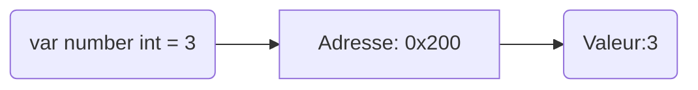
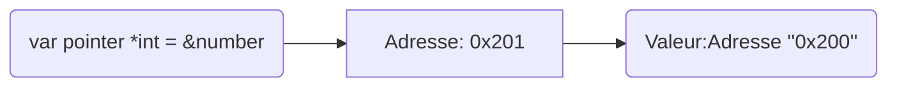

# Les Pointeurs
Les pointeurs permettent d'accéder à des variables ou à leur position dans la mémoire au-delà de leur localité.
Un pointeur se reconnais à l'asterisque `*` précédent le nom de la variable. Ex: `*pointer`
Un opérateur, lui, se reconnnait à l'esperluette `&` qui le précède. Ex: `&operator`
Lorsqu'une variable est attribuée, une adresse sur la mémoire du programme lui est allouée, 
Par exemple:


Déclarer la variable `number` va allouer dans cet exemple l'adresse `0x200`, et y associer la valeur `3`.

Déclarer le pointeur `pointer` et y définir l'opérateur de `number` va allouer l'adresse `0x201` et y associer le contenu de l'adresse `0x200`, donc `3`.

Un pointeur doit contenir un opérateur, représentant une adresse dans la mémoire. Modifier le`*pointer` revient à modifier le contenu de la variable `number`.
```Go
var number int = 3
var pointer *int = &number
*pointer = 7
fmt.Println(nb) // Affichera 7
```