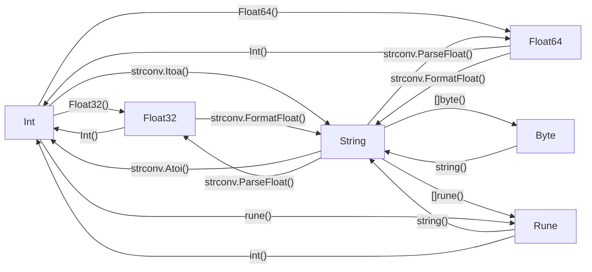

# Les Variables

Les variables sont une composante essentielle du code, quel que soit le langage utilisé. Elle permettent de stocker et traiter des données ponctuelles, saisies, issues d'algorithmes ou de bases de données, etc.

## Golang

En **Golang**, on peut déclarer une variable selon quelques patternes spécifiques :

```Golang
// nomDeLaVariable TypeDeVariable = ValeurDeLaVariable
var  myStr  string = "MyString" // Déclaration classique

myStr := "MyString" // Déclaration simplifiée

func  myFun(myStr string) { // Déclaration au sein d'une fonction

var myStr string // Déclaration de variable vide

```

Les deux premiers exemples peuvent être utilisés n'importe où dans le code, le troisième se déclare lors des déclarations de fonction.

A l'exception de la déclaration simplifiée, en golang le type de variable attendue doit très souvent, si ce n'est toujours être spécifiée.

| Type | Déclaration | Syntaxe |
|--------|--------------|-----------|
| Texte | String | "MyString" |
| Nombre Entier | Int | 0 |
| Nombre à virgule | Float32 ou Float64 | 0.0 |
| Caractère ASCII | Rune | '0' ou 58 |
| Condition (vrai/faux) | Bool | true ou false |
| N'importe quelle donnée | interface{} | Syntaxe de la donnée correspondante, ex: interface{} = "MyString" |
| Tableau de donnée | [] attachés à la déclaration correspondante, attaché à {} entre lesquelles vous intégrez les valeurs séparées d'une virgule | ex: []string{"StringA", "StringB"}
| Octet | Byte | de 0 à 255 |


Certaines déclaration nécessite de préciser la mémoire qui leur est allouée comme Float qui nécessite d'être Float32 ou Float64, dans le cas de Int, il peut être classique, Int8, Int16, Int32 ou Int64.

Des variables peuvent être déclarées vide, si, lors de sa déclaration, aucune valeur ne lui est assignée (impossible en déclaration simplifiée). De même pour les tableaux de données, il suffit de laisser les {} devant contenir leurs données vide.

Dans le cas des Bool (Booléens) ils sont faux par défaut.

Une grande parties des variables sont convertibles d'un type à un autre grâce à des fonctions, qu'elles soient dans le built-in, ou via des bibliothèques.

Les plus connus étant :



Toutes les fonctions exposées ne demandent pas toutes le même nombre d'arguments, ni ne renvoient toutes le même nombre de variables, restez prudents.

  

## Manipulation des variables

Les variables peuvent être traitées, transformées etc. selon le besoin et leur type.

Les valeurs numériques (rune, int, float, byte) peuvent se voir ajoutées une valeur, tant que cette dernière est au bon format.

```Golang
Exemples (nombres):
var counter int = 2
counter = counter + 3 // counter vaut désormais 5

var counter float64 = 2.0
counter += 3.0 // counter vaut désormais 5.0

var counter int = 3
counter *= 3 // counter vaut désormais 9

```

Dans le cadre des variables texte, la concaténation permet de fusionner deux variables string en une seule.

```Golang
Exemples (textes):
var str string = "firstString"
str = str + "secondString" 

str += "secondString"
// str vaudra "firstStringsecondString" dans les deux cas
```

Le contraire de la concaténation serait le split, consistant à séparer en un tableau de string, une suite de caractères données, selon une chaine de caractère les séparant.

- Golang : strings.Split(chaine, separateur)

- Javascript : \<votre  variable>.split(separateur)

Ces fonctions retournent un tableau de type string pouvant ensuite être traitées.
>A déplacer dans une fiche dédiée aux strings
  
## Globalité et Localité des variables

Une variable peut être globale ou locale, lorsqu'elle est globale, elle peut être utilisée sur l'ensemble du programme, mais elle doit être déclarée en dehors de toute fonction. Autrement, elle sera locale, et sa portée sera limitée à la fonction en elle-même. Selon le langage, la portée des variables locales peut être plus limitée.
```Golang
Exemples :
var globalVar string // Variable globale effective partout 
func myFunc() {
	var localVar string // Variablelocale effective uniquement dans la fonction
	for (i := 0; i < 5; i++) { // Boucle de répétition
		var localestVar string // Variable locale effective qu'au sein de la boucle
	}
}
```